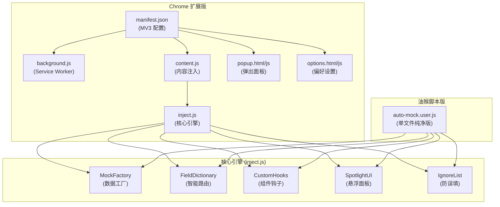

# Auto Mock Test Data

## 项目愿景

面向**前端开发与测试人员**的**极速、轻量级**表单数据模拟工具。为 **Element UI / Vue** 生态深度定制，支持全量一键填充与点选填充。提供 Chrome 原生扩展和 Tampermonkey 油猴脚本双版本。

## 架构总览

## 模块索引

| 模块 | 路径 | 说明 |
|------|------|------|
| chrome-extension | [`./chrome-extension/`](./chrome-extension/) | Chrome MV3 扩展（含配置面板） |
| tampermonkey-script | [`./tampermonkey-script/`](./tampermonkey-script/) | 油猴单文件脚本 |

## 全局规范

- **语言**: 纯原生 JavaScript，零外部依赖
- **浏览器兼容**: 支持 Manifest V3 标准
- **通信机制**: 扩展版通过 `chrome.runtime.sendMessage` + `window.postMessage` 桥接；油猴版通过 `GM_getValue/GM_setValue` 持久化配置
- **Vue 适配**: 通过 `__vue__` 属性穿透访问 Vue 组件实例，使用 `$emit('input')` / `$emit('change')` 触发响应式更新

## Mermaid 结构图

已在上方架构总览中生成。

## 导航面包屑

- 根目录 → [chrome-extension](./chrome-extension/CLAUDE.md)
- 根目录 → [tampermonkey-script](./tampermonkey-script/CLAUDE.md)
